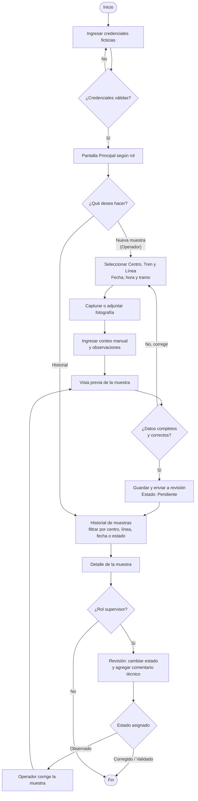

<p align="center">
  
</p>

<h1 align="center">MusselApp</h1>

<p align="center">
  App móvil para el registro y trazabilidad de muestras de choritos en centros de cultivo.<br>
  Caso académico <strong>AquaSample · ALDEMAR SpA</strong> · DSY1105 Desarrollo de Aplicaciones Móviles · Duoc UC Sede Puerto Montt
</p>

---

## 1. Propósito

En el muestreo de líneas de cultivo de choritos, el operador extrae un tramo representativo de la cuerda, cuenta los individuos, toma fotografías y registra observaciones. Hoy ese flujo es manual y la información queda dispersa entre planillas, fotos y notas, lo que dificulta el seguimiento histórico de una misma línea.

**MusselApp** es un MVP Android que apoya ese proceso:

- Registro de muestras por **centro, tren, línea, fecha, hora y tramo**, con conteo manual y observaciones.
- **Evidencia fotográfica** asociada a cada muestra (cámara o galería, imágenes de prueba sin personas).
- **Validación** de campos obligatorios antes de guardar.
- **Historial** consultable con filtros por centro, línea, fecha, operador o estado.
- **Flujo de revisión** del supervisor con estados *Pendiente → Observado → Corregido → Validado*.
- Persistencia local pensada para **conectividad limitada** en terreno.

> Proyecto académico con datos ficticios. No reemplaza el criterio técnico de ALDEMAR ni realiza conteo automático.

## 2. Identidad visual

| Elemento | Definición |
|---|---|
| Nombre | **MusselApp** |
| Logotipo | [`docs/diseno/logo.png`](docs/diseno/logo.png) · [`logo.svg`](docs/diseno/logo.svg) — representa el chorito chileno y la conexión con el mar del sur de Chile |

### Paleta de colores

| Color | HEX | Uso |
|---|---|---|
| Principal | `#0F172A` | Encabezados, TopAppBar y botones de acción clave (CTA) |
| Secundario | `#334155` | Encabezados de tablas, botones secundarios y navegación |
| Fondo | `#F1F5F9` | Fondo general; evita deslumbramiento bajo luz solar directa |
| Texto | `#000000` | Títulos, lecturas de datos y etiquetas de alto contraste |
| Adicional | `#64748B` | Bordes de tarjetas, divisores, textos secundarios y metadatos |

Paleta sobria y de alto contraste, pensada para una empresa de servicios y para uso en terreno.

## 3. Flujo de usuario (Diagrama de Actividad UML)

Imagen exportada: [`docs/diseno/flujo-usuario-uml.png`](docs/diseno/flujo-usuario-uml.png) · Fuente: [`flujo-usuario-uml.mmd`](docs/diseno/flujo-usuario-uml.mmd)



## 4. Pantallas principales

Diseños generados con **Google Stitch** (Material Design 3) y guardados en [`docs/diseno/interfaces/`](docs/diseno/interfaces/).

| # | Pantalla | Usuario principal | Acción principal | Archivo |
|---|---|---|---|---|
| 1 | Login | Operador, Supervisor, Admin | Ingresar con usuario ficticio y rol | `01-login.png` |
| 2 | Principal | Operador, Supervisor, Admin | Menú de opciones según permisos | `02-principal.png` |
| 3 | Muestra | Operador | Formulario: centro, tren, línea, fecha, tramo, conteo | `03-muestra.png` |
| 4 | Captura | Operador | Tomar fotografía o elegir de galería | `04-captura.png` |
| 5 | Vista previa | Operador | Confirmar datos y foto antes de enviar | `05-vista-previa.png` |
| 6 | Historial | Operador, Supervisor | Listar, buscar y filtrar muestras | `06-historial.png` |
| 7 | Detalle | Operador, Supervisor | Ver datos, foto y trazabilidad de una muestra | `07-detalle.png` |
| 8 | Revisión del Supervisor | Supervisor | Cambiar estado y agregar comentario técnico | `08-revision.png` |

### Navegación

| Componente | ¿Se utiliza? | Para qué |
|---|---|---|
| NavigationBar | Sí | Moverse entre Inicio, Historial y Perfil |
| NavigationDrawer | No | — |
| TopAppBar | Sí | Título de pantalla, volver y acciones disponibles según rol |
| Botón principal / FAB | Sí | Acción rápida "Nueva muestra" para el operador |

## 5. Integrantes — Equipo Pipeño (Sección 004V)

| Nombre | Rol |
|---|---|
| Jesús Cárdenas | Front-end |
| Ramón Osorio | UI/UX & Mobile Developer |
| Lucas Saldivia | QA & Data Engineer |

## 6. Tecnologías

- **Kotlin** + **Jetpack Compose** con **Material 3**
- Arquitectura **MVVM** (Model · ViewModel · UI · Repository)
- Persistencia local con **Room** / **DataStore**
- Cámara y galería mediante **CameraX** / Activity Result API
- **Gradle** (Kotlin DSL), Android Studio
- Diseño: **Google Stitch**, Mermaid para UML

## 7. Estructura del repositorio

```
docs/
├── diseno/
│   ├── logo.png · logo.svg
│   ├── flujo-usuario-uml.png · flujo-usuario-uml.mmd
│   └── interfaces/          # pantallas exportadas desde Stitch
└── evidencias/
    └── clase-02/            # Evidencia_Clase_02_Diseno_EquipoPipeno
```
